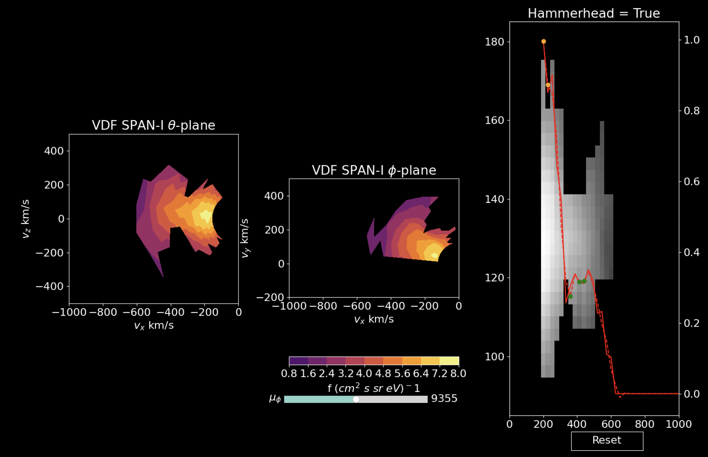

## Installation
To get `hampy`, simply git clone this repository in your terminal using the command
```
git clone https://github.com/srijaniiserprinceton/hampy.git
```

## Getting started
In order to get started, you need to have a Python environment with all the packages listed in `pyspeads_env.yml`. If you want to install the `hampy` environment, see the last section in this readme document.

The required directory structure can be build by running the following lines in your command line
```
mkdir data plots
```
To get the interactive `hammerfinder` plot first run `ipython` in your command line to enter `IPython` mode. Next, execute the following line in your `IPython` terminal.
```
run interactive_hammerchecks.py
```
It should load an interactive plotting widget where you can change the time by clicking the time index bar at the bottom of the plot.



## Changing the time to your desired VDF epoch
In order to change the default time it opens, you can change the following lines in `interactive_hammerchecks.py`
```
if __name__=='__main__':
    # user defined date and time
    year, month, date = 2020, 1, 29
    hour, minute, second = 18, 10, 1  
```

## Installing the `hampy` python environment
If you are unsure about having the correct Python environment, or are a new Python user, I would recommend setting up an enviroment using the two lines below. Note that
the default name of the environment will be `pyspedas` but you can change this to anything you want (such as `myenv`) by changing the name in the first line of `pyspedas_env.yml`.
```
conda env create --file pyspedas_env.yml
conda activate pyspedas
```


